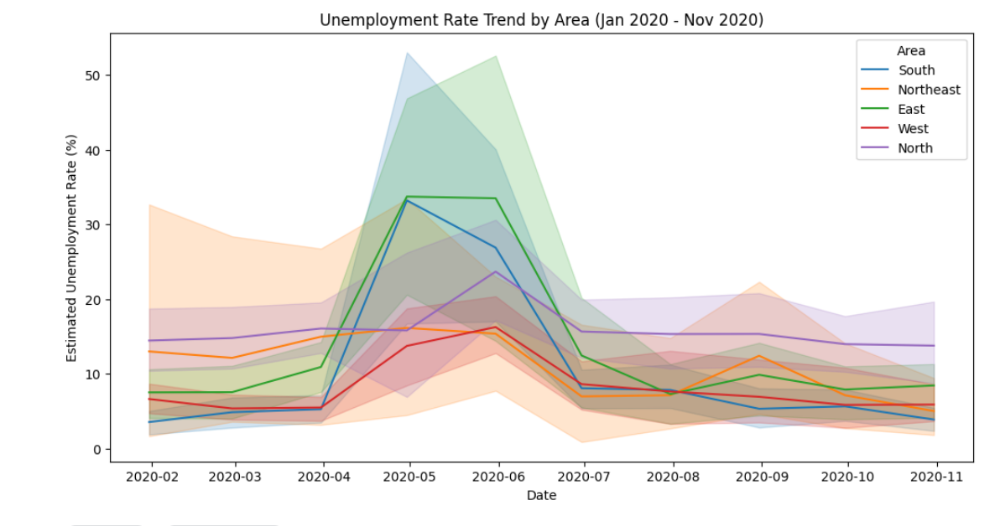
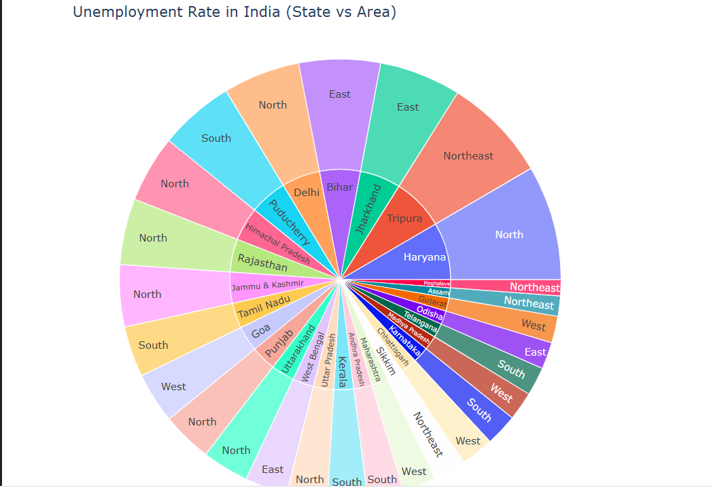

# Unemployment Analysis with Python 

# Project Overview
This project analyzes the impact of the 2020 lockdown on unemployment rates in India. Using Python, I visualized the sharp increase in unemployment during the COVID-19 pandemic.

# Key Insights
- **Lockdown Impact:** A massive spike is visible in April-May 2020 across all regions.
- **Regional Analysis:** The Sunburst chart highlights how different states contributed to the national average.

# Visualizations

# Unemployment Trend (COVID-19 Spike)

# Regional Distribution (Sunburst Chart)

# Tools
- Python (Pandas, Seaborn, Plotly)
- Kaggle Notebooks
